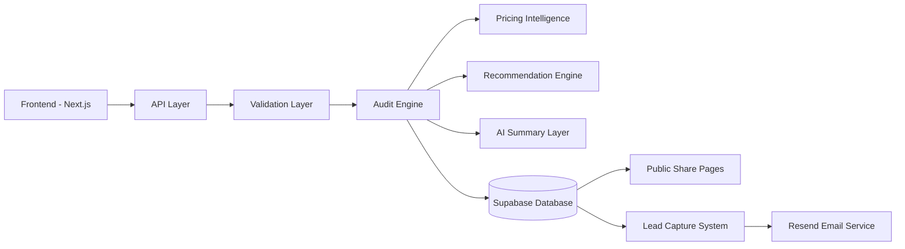

# ARCHITECTURE.md

## System Architecture

### Overview

AI Spend Audit is a full-stack SaaS platform that helps startups and engineering teams analyze, benchmark, and optimize their AI tooling expenses.

The platform is intentionally designed around deterministic financial logic instead of AI-driven calculations. LLMs are only used for executive-style summaries and never for pricing math, recommendation generation, or savings calculations.

This separation improves:

* financial trustworthiness
* audit reproducibility
* scalability
* maintainability
* testing reliability

The architecture prioritizes:

* production-oriented engineering
* modular system design
* fast iteration velocity
* low operational cost
* strong user experience

---

# High-Level Architecture



---

# Core Architecture Philosophy

The system separates:

* deterministic financial computation
* recommendation logic
* pricing intelligence
* AI summarization
* persistence workflows
* public-sharing infrastructure

This prevents:

* hallucinated pricing outputs
* inconsistent recommendations
* unreliable savings calculations
* non-reproducible audits

Initially, I considered building fully AI-generated recommendations, but rejected that approach because deterministic audit logic is easier to verify, test, and trust financially.

I also intentionally kept pricing data static during MVP development to guarantee audit reproducibility and avoid dependency on unstable vendor APIs.

---

# Tech Stack

## Frontend

* Next.js App Router
* TypeScript
* Tailwind CSS
* shadcn/ui
* Framer Motion
* Recharts

## Backend

* Next.js Route Handlers
* TypeScript
* Zod Validation
* OpenRouter API

## Database

* Supabase PostgreSQL

## Infrastructure

* Vercel
* GitHub Actions
* Resend Email API

---

# Why This Stack

## Why Next.js

I chose Next.js App Router because it allows:

* frontend and backend in a single repository
* server-side rendering for public audit pages
* simplified Open Graph metadata generation
* efficient deployment on Vercel
* scalable API routes
* SEO-friendly shareable pages

Compared to separate frontend/backend architectures, this reduced complexity significantly for MVP velocity.

---

## Why TypeScript

TypeScript improves:

* audit-engine safety
* typed pricing calculations
* predictable API contracts
* maintainability as pricing rules grow

Since financial calculations are involved, type safety was important to reduce logic bugs.

---

## Why Supabase

Supabase provides:

* hosted PostgreSQL
* simple authentication-ready infrastructure
* easy row persistence
* scalable relational storage

It was chosen over Firebase because relational queries fit audit-report storage better.

---

# Folder Structure

```txt
/app
  /api
  /audit
  /share

/components
/lib
  /audit-engine
  /pricing
  /recommendations
  /summary
/data
/types
/public
/styles
```

This structure separates:

* UI logic
* financial logic
* pricing systems
* recommendation systems
* persistence workflows

which improves maintainability as the platform scales.

---

# Frontend Architecture

## Frontend Responsibilities

The frontend layer handles:

* landing page rendering
* dynamic spend forms
* audit result dashboards
* charts and analytics
* lead capture flows
* public share pages
* responsive mobile layouts

---

# Frontend User Flow

```txt
Landing Page
→ Spend Input Form
→ Audit Submission
→ Loading State
→ Audit Results Dashboard
→ Lead Capture
→ Shareable Public Report
```

---

# State Management

Current implementation:

* React Hook Form
* localStorage persistence
* route-based rendering

The form state persists across reloads to improve usability and reduce abandonment.

Future improvements:

* Zustand
* React Query
* optimistic updates
* server state caching

---

# Backend Architecture

## API Layer

The backend uses Next.js Route Handlers for lightweight server-side orchestration.

---

## POST `/api/audit`

Responsibilities:

* validate payloads
* orchestrate audit execution
* calculate savings
* generate recommendations
* persist audit data
* return structured results

---

## POST `/api/summary`

Responsibilities:

* generate AI-powered summaries
* consume deterministic audit outputs
* gracefully fallback during LLM failures

AI summaries are isolated from financial calculations.

---

## POST `/api/leads`

Responsibilities:

* persist lead data
* connect audits to leads
* generate shareable report URLs
* trigger email delivery

---

## GET `/api/share?id=`

Responsibilities:

* retrieve public audit reports
* expose non-sensitive data
* support social sharing pages

---

# Validation Layer

Validation uses:

* Zod schemas
* typed request parsing
* structured payload constraints

This improves:

* API reliability
* predictable orchestration
* input safety
* audit consistency

---

# Audit Engine Architecture

## Core Principle

The audit engine is fully deterministic.

LLMs are NOT responsible for:

* pricing calculations
* savings generation
* recommendation scoring
* financial reasoning

This prevents:

* hallucinated outputs
* inconsistent audits
* non-testable business logic

---

# Audit Engine Flow

```txt
Input Payload
→ Pricing Lookup
→ Plan Analysis
→ Recommendation Generation
→ Savings Calculation
→ Confidence Scoring
→ Structured Audit Output
```

---

# Pricing Intelligence Layer

## Responsibilities

The pricing layer handles:

* vendor pricing normalization
* plan resolution
* spend comparison
* pricing baselines
* optimization reference data

---

# Current Supported Vendors

* ChatGPT
* Claude
* Cursor
* GitHub Copilot
* Gemini
* Anthropic API
* OpenAI API
* Windsurf / v0

---

# Pricing Data Strategy

Pricing data is currently stored statically for:

* deterministic testing
* audit reproducibility
* lower infrastructure complexity

Each pricing value maps directly to:

* official vendor pricing pages
* manually verified pricing entries

Future improvements:

* scheduled pricing sync jobs
* API-based pricing ingestion
* historical pricing tracking

---

# Recommendation Engine

The recommendation engine analyzes:

* team size
* pricing inefficiencies
* enterprise plan misuse
* subscription mismatches
* usage patterns

Outputs:

* recommended plans
* estimated savings
* confidence scores
* reasoning explanations

The recommendation logic is rule-based instead of AI-generated to ensure explainability.

---

# AI Summary Layer

## OpenRouter Integration

OpenRouter is used for:

* executive-style summaries
* human-readable optimization explanations

---

# Important Architectural Constraint

AI-generated summaries are isolated from:

* pricing intelligence
* deterministic calculations
* recommendation scoring

This architecture ensures:

* financial consistency
* reproducibility
* safer AI integration

---

# Database Architecture

## Stack

* Supabase PostgreSQL

---

# Current Tables

## audits

Stores:

* audit results
* pricing outputs
* recommendations
* savings calculations
* public report IDs

---

## leads

Stores:

* email captures
* company metadata
* audit associations

---

# Persistence Flow

```txt
Audit Generated
→ Persist Audit
→ Generate Public Share ID
→ Capture Lead
→ Associate Lead with Audit
→ Send Confirmation Email
```

---

# Public Share Infrastructure

## Dynamic Public Reports

Routes:

```txt
/audit/[id]
```

Public pages expose:

* recommendations
* charts
* savings analytics

Sensitive data intentionally excluded:

* email addresses
* company names
* internal metadata

---

# Open Graph Infrastructure

Public audit pages generate:

* Twitter cards
* Open Graph previews
* dynamic metadata

This improves:

* virality
* social sharing
* Product Hunt compatibility

---

# Email Infrastructure

## Stack

* Resend

Responsibilities:

* audit delivery
* public-share links
* lead confirmation
* high-savings consultation prompts

---

# Caching Strategy

Current MVP caching:

* pricing data cached in-memory during runtime

Future improvements:

* Redis caching
* CDN caching for public reports
* Incremental Static Regeneration
* edge caching for shared pages

---

# CI/CD Architecture

## GitHub Actions

Current pipeline validates:

* dependency installation
* linting
* production builds
* automated tests

Future additions:

* Lighthouse automation
* preview deployments
* accessibility checks

---

# Accessibility Considerations

The frontend follows:

* semantic HTML
* keyboard navigation support
* accessible color contrast
* ARIA labels for forms
* responsive mobile-first layouts

Target Lighthouse scores:

* Performance ≥ 85
* Accessibility ≥ 90
* Best Practices ≥ 90

---

# Failure Handling

The system gracefully handles:

* LLM API failures
* invalid pricing payloads
* database write failures
* email delivery failures
* malformed audit requests

Fallback summaries are generated when AI providers fail.

This prevents broken audit experiences for end users.

---

# Scalability Considerations

Potential future improvements for 10k+ audits/day:

1. Move audit execution into async job queues

   * BullMQ
   * Redis queues
   * AWS SQS

2. Introduce caching layers

   * Redis
   * CDN edge caching

3. Horizontally scale compute workers

   * serverless workers
   * Kubernetes worker pools

4. Offload PDF generation

   * dedicated rendering workers
   * Headless Chromium services

5. Add observability infrastructure

   * Prometheus
   * Grafana
   * centralized logging

---

# Security Considerations

Current safeguards:

* Zod validation layer
* typed payload parsing
* environment variable isolation
* deterministic financial calculations
* restricted public exposure
* sanitized public share pages

No secrets are stored in the repository.

---

# Design Philosophy

The platform prioritizes:

* deterministic correctness
* production-oriented engineering
* modular architecture
* financial trustworthiness
* scalable SaaS infrastructure
* modern startup UX

The goal of the architecture is not just to pass an assignment, but to resemble a product that Credex could realistically launch publicly with minimal additional engineering effort.
